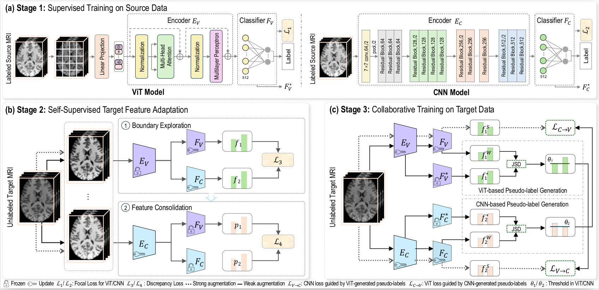

# CDA

## Learning from Heterogeneous Structural MRI via Collaborative Domain Adaptation for Late-Life Depression Assessment

## Abstract
<div align="justify">

Accurate identification of late-life depression (LLD) using structural brain MRI is es-
sential for monitoring disease progression and facilitating timely intervention. How-
ever, existing learning-based approaches for LLD detection are often constrained by
limited sample sizes (e.g., tens), which poses significant challenges for reliable model
training and generalization. Although incorporating auxiliary datasets can expand the
training set, substantial domain heterogeneity, such as differences in imaging protocols,
scanner hardware, and population demographics, often undermines cross-domain trans-
ferability. To address this issue, we propose a Collaborative Domain Adaptation (CDA)
framework for LLD detection using T1-weighted MRIs. The CDA leverages a Vision
Transformer (ViT) to capture global anatomical context and a Convolutional Neural
Network (CNN) to extract local structural features, with each branch comprising an
encoder and a classifier. The CDA framework consists of three stages: (a) supervised
training on labeled source data, (b) self-supervised target feature adaptation and (c)
collaborative training on unlabeled target data. We first train ViT and CNN on source
data, followed by self-supervised target feature adaptation by minimizing the discrep-
ancy between classifier outputs from two branches to make the categorical boundary
clearer. The collaborative training stage employs pseudo-labeled and augmented target-
domain MRIs, enforcing prediction consistency under strong and weak augmentation
to enhance domain robustness and generalization. Extensive experiments conducted on
multi-site T1-weighted MRI data demonstrate that the CDA consistently outperforms
state-of-the-art unsupervised domain adaptation methods.

</div>

## Pipeline


## Requirements

- Python version 3.9 or higher is required.
- It is recommended to use an NVIDIA GPU environment with CUDA 12.9 support  
  (NVIDIA-SMI version 575.57.08, Driver Version: 575.57.08, CUDA Version: 12.9).

All dependencies are listed in the `requirements.txt` file. You can install them with:

```bash
pip install -r requirements.txt
```

## Usage

1. Clone the repository:

```bash
git clone https://github.com/yzgao2017/CDA.git
cd yourproject


